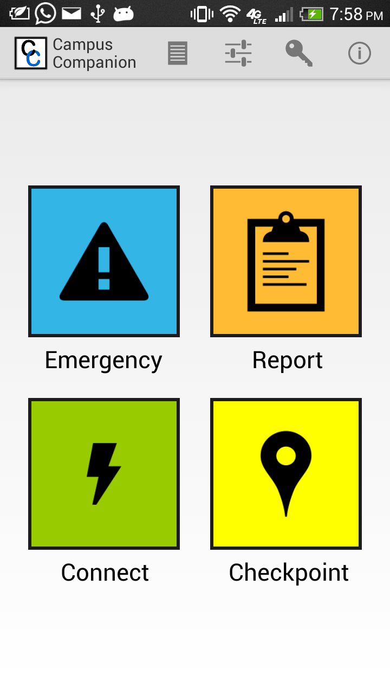
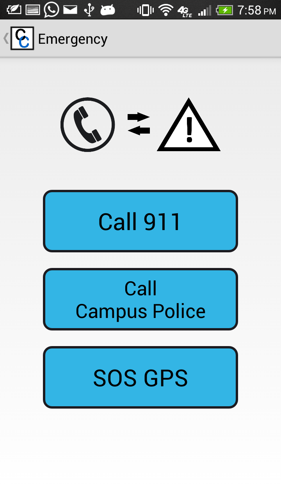
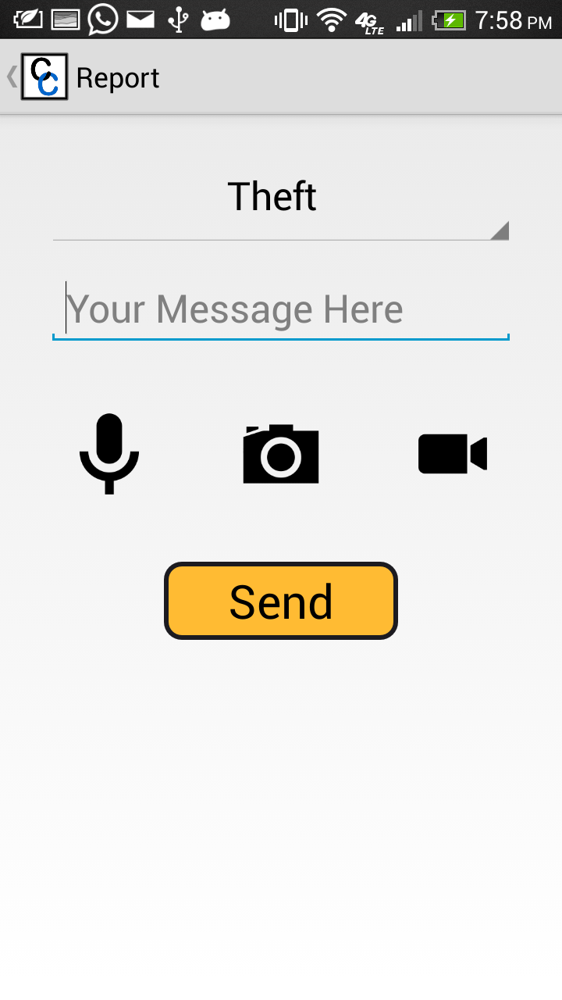
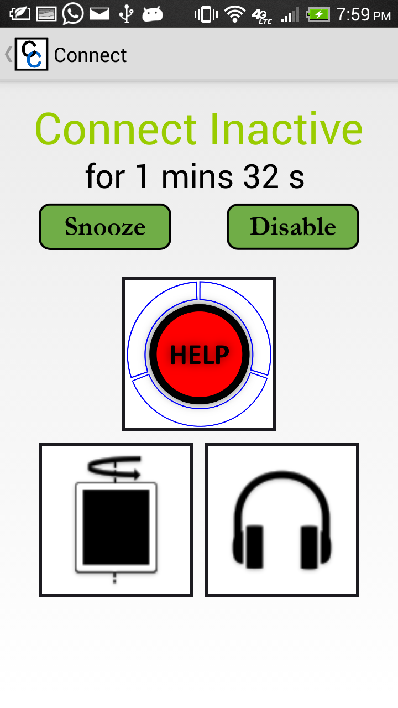

Campus-Companion was part of [Duke start-up challenge](http://www.dukestartupchallenge.org/) in 2013. More information can be found in this [video](https://youtu.be/_dHv3oYvpsc) and at this [website](http://campuscompanion.weebly.com/).

Development of features in this app was done in close collaboration with Dr. Jordan Malof, Dr. Nicholas Czarneck and Alex Sonageri. Here are some screenshots from the app.

### Main page

### Emergency page

### Report page

### Connect page

